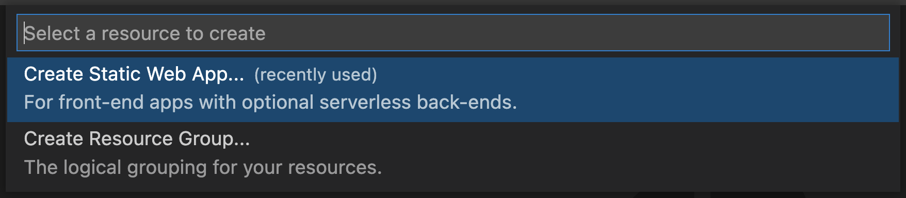
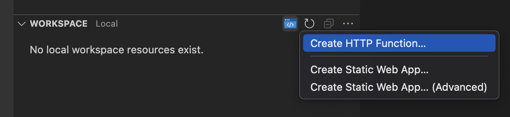

# Azure Static Web Apps (Preview) for Visual Studio Code

<!-- region exclude-from-marketplace -->

  

<!-- endregion exclude-from-marketplace -->

Use this extension to quickly create and manage Azure Static Web Apps (Preview) directly from VS Code.

**Visit the [wiki](https://github.com/Microsoft/vscode-azurestaticwebapps/wiki) for additional information about the extension.**

> Sign up today for your free Azure account and receive 12 months of free popular services, $200 free credit and 25+ always free services 👉 [Start Free](https://azure.microsoft.com/free/open-source).

## Create your first static web app

1. Click the '+' button in the explorer to setup a new static web app

    
1. Authorize access to your GitHub account so the extension can find your repositories

    

    
1. Select a repository and branch that will be deployed to the static web app
    > If your local project has a remote configured, the extension will default to that repository
1. Provide the app folder name
    > Location of your application code. For example, '/' represents the root of your app, while '/app' represents a directory called 'app'.
1. Provide the api folder name (optional)
    > Location of your Azure Functions code. For example, '/api' represents a folder called 'api'. If you don't have an Azure Functions project yet, don't worry!  This is optional so just leave this blank.
1. Provide the build artifact folder name
    > The path of your build output relative to your apps location. For example, setting a value of 'build' when your app location is set to '/app' will cause the content at '/app/build' to be served.

## Updating your static web app

Commit and push your changes to the GitHub repository that your static web app is configured to.  It will then use [GitHub Actions](https://github.com/features/actions) to update your app.

If you create a pull request through GitHub, GitHub Actions will create a staging environment with your new changes live.  Your Production environment and staging environments are all listed within your Static Web App as well as application settings.

> **IMPORTANT:** The application settings only apply to the backend API of an Azure Static Web App.

## Create a HTTP Function for your static web app

You can add a serverless API to your static web app by creating a HTTP Functions project.

1. Open your static web app project in your Visual Studio Code workspace
1. Select the button to create a new HTTP Function

    

1. Provide a HTTP Function name that is unique to your API
1. If this is your first HTTP Function, select a language for your API

<!-- region exclude-from-marketplace -->

## Contributing

There are a couple of ways you can contribute to this repo:

* **Ideas, feature requests and bugs**: We are open to all ideas and we want to get rid of bugs! Use the Issues section to either report a new issue, provide your ideas or contribute to existing threads.
* **Documentation**: Found a typo or strangely worded sentences? Submit a PR!
* **Code**: Contribute bug fixes, features or design changes:
  * Clone the repository locally and open in VS Code.
  * Install [TSLint for Visual Studio Code](https://marketplace.visualstudio.com/items?itemName=ms-vscode.vscode-typescript-tslint-plugin).
  * Open the terminal (press `CTRL+`\`) and run `npm install`.
  * To build, press `F1` and type in `Tasks: Run Build Task`.
  * Debug: press `F5` to start debugging the extension.

### Legal

Before we can accept your pull request you will need to sign a **Contribution License Agreement**. All you need to do is to submit a pull request, then the PR will get appropriately labelled (e.g. `cla-required`, `cla-norequired`, `cla-signed`, `cla-already-signed`). If you already signed the agreement we will continue with reviewing the PR, otherwise system will tell you how you can sign the CLA. Once you sign the CLA all future PR's will be labeled as `cla-signed`.

### Code of Conduct

This project has adopted the [Microsoft Open Source Code of Conduct](https://opensource.microsoft.com/codeofconduct/). For more information see the [Code of Conduct FAQ](https://opensource.microsoft.com/codeofconduct/faq/) or contact [opencode@microsoft.com](mailto:opencode@microsoft.com) with any additional questions or comments.

<!-- endregion exclude-from-marketplace -->

## Telemetry

VS Code collects usage data and sends it to Microsoft to help improve our products and services. Read our [privacy statement](https://go.microsoft.com/fwlink/?LinkID=528096&clcid=0x409) to learn more. If you don’t wish to send usage data to Microsoft, you can set the `telemetry.enableTelemetry` setting to `false`. Learn more in our [FAQ](https://code.visualstudio.com/docs/supporting/faq#_how-to-disable-telemetry-reporting).

## License

[MIT](LICENSE.md)
